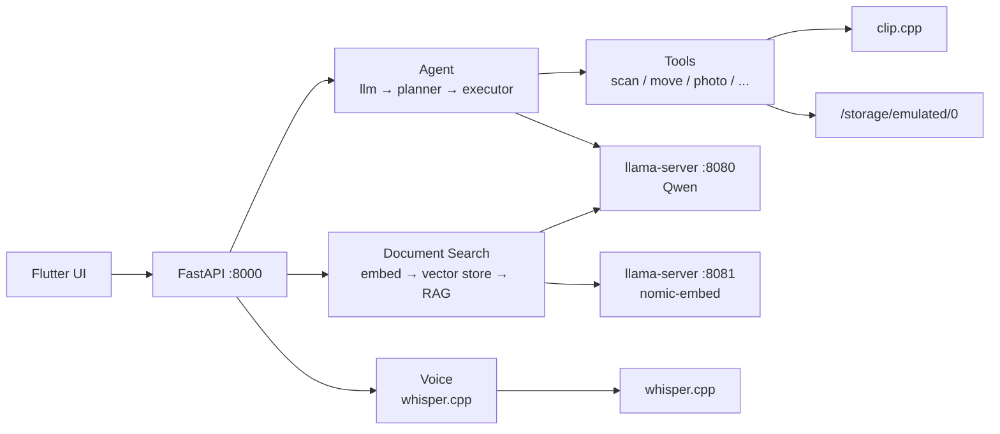

# PocketMind — Architecture

All inference runs on-device. Internet only for initial model downloads.

---

## Request Flow

**Agent path:** query → `get_intent()` → `plan()` → `execute()` → tool

**Doc search path:** query → `embed_query()` → `vector_store.search()` → `answer_question()` (optional LLM)

---

## Components

| Layer | Key files | Role |
|---|---|---|
| Entry | `backend/main.py` | Mounts `/agent`, `/docs`, `/audio` routers |
| Agent | `llm.py`, `planner.py`, `executor.py` | NL → JSON intent → resolved plan → tool call |
| Tools | `ai-file-manager/tools/*.py` | File ops, duplicates, insights, photo search |
| Doc search | `scanner.py`, `embedder.py`, `vector_store.py`, `qa.py` | Index, embed, search, RAG |
| Voice | `extract_audio_text.py`, `audio_routes.py` | ffmpeg → whisper-cli → transcript |
| Photo | `photo_search.py`, `index_images.py` | CLIP index + text→image search |

---

## Agent Tools

| Tool | Module | Confirm? |
|---|---|---|
| scan | `scan.py` | No |
| move | `move.py` | Yes |
| rename | `rename.py` | Yes |
| delete | `delete.py` | Yes (+ CLI `DELETE` typing) |
| insights | `storage_insights.py` | No |
| find_duplicates | `duplicate_detection.py` | No |
| locate_file | `locate_file.py` | No |
| search_documents | `search_documents.py` | No |
| photo_search | `photo_search.py` | No |

---

## Models

| Model | Port / binary | Used by |
|---|---|---|
| `qwen2.5-1.5b-instruct-q4_k_m.gguf` | llama-server :8080 | `llm.py`, `qa.py` |
| `nomic-embed-text-v1.5.Q4_K_M.gguf` | llama-server :8081 | `embedder.py` |
| `ggml-base-q5_1.bin` | whisper-cli | `extract_audio_text.py` |
| `clip-vit-b32-q5_1.gguf` | clip.cpp | `photo_search.py` |

---

## API Status Codes

| Status | Meaning |
|---|---|
| `executed` | Done |
| `needs_confirmation` | Client must confirm, then resend or call `/agent/execute-plan` |
| `needs_choice` | Multiple file matches — send `choice_index` |
| `failed` | Error during plan or execution |

---

## Example: Voice → "find my resume"

1. Flutter uploads audio → `POST /audio/transcribe`
2. `extract_transcript()` → ffmpeg + whisper-cli → `"find my resume"`
3. Transcript → `POST /agent/execute`
4. `get_intent()` → `{"tool": "locate_file", "query": "find my resume"}`
5. `locate_file()` → filename scan, then vector search fallback
6. Response → `{"status": "executed", "result": {"results": [{"path": ".../resume.pdf"}]}}`

---

## Data Files

| Path | Contents |
|---|---|
| `backend/data/doc_vectors.npy` | Document chunk embeddings |
| `backend/data/doc_metadata.json` | Chunk path, text, index |
| `backend/data/manifest.json` | Index skip-cache by file signature |
| `~/clip.cpp/build/` | CLIP photo index |

---

## Local vs External

| Subsystem | Cloud at runtime? |
|---|---|
| LLM, embeddings, RAG, CLIP, whisper, file ops | No |
| Model download, git clone, pip install | Yes (once) |
| Tailscale (Flutter → phone) | Optional LAN mesh |

---

## Design Notes

| Decision | Why |
|---|---|
| On-device only | Privacy; works offline after setup |
| LLM emits short names, planner resolves paths | Prevents path hallucination |
| `needs_confirmation` / `needs_choice` JSON | Same code serves CLI and HTTP without blocking `input()` |
| Dry-run default on move/rename/delete | Safe by default; confirm to execute |
| CLIP not captioning | Direct text→image vector match, no generation step |
| Two llama-server instances | Chat and embedding models need different context/RoPE config |
| Filename match before semantic search | Fast exact hits; vector fallback for vague queries |
| Chunk-level doc index + manifest | Incremental re-index; large files split into searchable pieces |
| Audio indexed as documents | Voice notes become searchable via `/docs/ask` after transcription |
